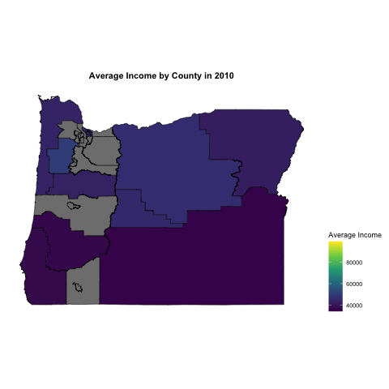

## Follow Along

https://github.com/paparker/Data_Curation_and_Viz
    


## The Tidyverse

The `tidyverse` is a group of packages in the R ecosystem that offer an alternative way to handle and work with data. Some of these packages are 

* `readr` for reading and writing data
* `tidyr` for creating tidy data frames
* `dplyr` for manipulating data
* `ggplot2` for data visualization

Most operations require data in the format of a data.frame/tibble.

## Reading in data

```{r, message=F, warning=F}
library(readr)
pums <- read_csv('../Data/psam_p41.csv')
pums

```

## Dplyr

Dplyr allows us to manipulate our data:

* `select()` subsets the column space
* `filter()` subsets the row space
* `mutate()` creates new variables/columns
* `group_by()` groups data for future operations
* `summarize()` aggregate data
* `join()` merges data from two sources


## The pipe operator

After loading `dplyr`, you will have access to the pipe operator `%>%` which feeds the argument on the left side as the first argument into the function on the right side.

```{r, message=F, warning=F, cache=F}
library(dplyr)
sum(1:10)
1:10 %>% sum()
```


## The pipe operator cont.

This allows for us to read a sequence of operations from left to right as we normally do.

```{r, message=F, warning=F, cache=T}

exp(sqrt(sum(1:10)))
1:10 %>% sum() %>% sqrt() %>% exp()
```


## Select

```{r, message=F, warning=F, cache=F}
pumsReduced <- pums %>% 
  select(PUMA, SALARY=WAGP, WEIGHT=PWGTP, AGE=AGEP, RACE=RAC1P, HICOV, NATIVITY)

pumsFinal <- pumsReduced %>% select(-NATIVITY)
str(pumsFinal)

```

## Filter
```{r, message=F, warning=F, cache=F}
pumsFinal <- pumsFinal %>% filter(SALARY > 0)
str(pumsFinal)

pumsFinal %>% filter(RACE %in% 1:3) %>% select(AGE) %>% summary()
```

## Mutate
```{r, message=F, warning=F, cache=F}
pumsFinal <- pumsFinal %>% mutate(WSALARY=WEIGHT*SALARY) %>%
  mutate(RACE=case_when(RACE==1 ~ "White",
                        RACE==2 ~ "Black",
                        RACE==3 ~ "American Indian",
                        RACE==4 ~ "Alaska Native",
                        RACE %in% c(5,8) ~ "Other",
                        RACE==6 ~ "Asian",
                        RACE==7 ~ "Pacific Islander",
                        RACE==9 ~ "Two or more races"))
str(pumsFinal)
```

## Grouping and summarizing
```{r, message=F, warning=F, cache=F}
ests <- pumsFinal %>% group_by(PUMA) %>% summarize(UW=mean(SALARY), HT=sum(WSALARY)/sum(WEIGHT))
ests
```


## Joins
```{r, message=F, warning=F, cache=T}
band_members
band_instruments
```

## Left join
```{r, message=F, warning=F, cache=T}
band_members %>% left_join(band_instruments, by="name")
```

## Right join
```{r, message=F, warning=F, cache=T}
band_members %>% right_join(band_instruments, by="name")
```

## Inner join
```{r, message=F, warning=F, cache=T}
band_members %>% inner_join(band_instruments, by="name")
```

## Full join
```{r, message=F, warning=F, cache=T}
band_members %>% full_join(band_instruments, by="name")
```


## Long vs. Wide Data

```{r, echo=F}
set.seed(1)
mice <- data.frame(MouseID=1:6, Treatment=c(rep("Sugar",3),rep("No Sugar",3)), Before=rnorm(6,3, sd=0.5), After=rnorm(6,c(5,5,5,3,3,3), sd=0.5))
```

<style>
.container{
    display: flex;
}
.col{
    flex: 1;
}
</style>

<div class="container">
<div class="col">
```{r, message=F, warning=F, cache=T}
mice
```
</div>
<div class="col">
```{r, message=F, warning=F, cache=F}
library(tidyr)
mice %>% 
  pivot_longer(3:4, names_to="Measurement", values_to="Time")
```
</div>
</div>


## Long vs. Wide Data Cont.

```{r, echo=F, warning=F, message=F}
library(dplyr)
library(tidyr)
comps <- data.frame(Company=c("Google", "Amazon"), Q1=c(15.6, 9.8), Q2=c(19.9,12.2), Q3=c(23.1,8.7), Q4=c(24.9,12.0))
comps <- comps %>% pivot_longer(-1, names_to="Quarter", values_to="EPS")
```

<style>
.container{
    display: flex;
}
.col{
    flex: 1;
}
</style>

<div class="container">
<div class="col">
```{r, message=F, warning=F, cache=T}
comps
```
</div>
<div class="col">
```{r, message=F, warning=F, cache=T}
comps %>% pivot_wider(names_from=Quarter, values_from=EPS)
```
</div>
</div>

##################
##### GGPLOT #####
##################


## ggplot2
- A graphics package built around a common "grammar"
<br/>
- Allows flexibility in plotting and ease of use
<br/>
- Allows the creation of new plots, tailored to the problem at hand

<style type="text/css">
body, td {
   font-size: 14px;
}
code.r{
  font-size: 16px;
}
pre {
  font-size: 20px
}
</style>

## Data
- To use ggplot, your data must be in the form of a data frame  
- We will start with a commonly used data frame, already available with the `ggplot2` package

```{r}
library(ggplot2)
mpg
```

## Creating your first plot!
<style>
.container{
    display: flex;
}
.col{
    flex: 1;
}
</style>

<div class="container">
<div class="col">
- All plots must start with the `ggplot()` function, this is your canvas
- `aes()` is used to map data components to their correct usage in the plot
- <b>geom</b>s can be added sequentially, and specify what type of plot you want
</div>
<div class="col">
```{r}
ggplot(mpg, aes(x=displ, y=hwy)) +
  geom_point()
```
</div>
</div>
<font color="red">How could we add more information to this plot?</font>

## Examples
<style>
.container{
    display: flex;
}
.col{
    flex: 1;
}
</style>

<div class="container">
<div class="col">
```{r, fig.height=5, warning=F, message=F}
ggplot(mpg, aes(x=displ, y=hwy, size=cty)) +
  geom_point() +
  geom_smooth(method="lm", se=F)
```
</div>
<div class="col">
```{r, fig.height=5, warning=F, message=F}
ggplot(mpg, aes(x=displ, y=hwy)) +
  geom_point(aes(color=class)) +
  geom_smooth(method="loess", se=T)
```
</div>
</div>
<font color="red">Keep iterating!</font>


## Common aesthetics

* <b>`x`</b> assigns a variable to the x-axis
* <b>`y`</b> assigns a variable to the y-axis
* <b>`color`</b> assigns a variable to control the color of geoms
* <b>`size`</b> assigns a variable to control the size of geoms
* <b>`shape`</b> assigns a variable to control the shape of geoms
* <b>`alpha`</b> assigns a variable to control the transparency of geoms
* <b>`fill`</b> assigns a variable to control the color that fills in a geom

<font color="red">What if we want to set an aesthetic to a fixed value?</font>

## Fixing aesthetics
<style>
.container{
    display: flex;
}
.col{
    flex: 1;
}
</style>

<div class="container">
<div class="col">
```{r, fig.height=4}
ggplot(mpg, aes(x=displ, y=hwy)) +
  geom_point(aes(color="blue")) 
```
</div>
<div class="col">
```{r, fig.height=4}
ggplot(mpg, aes(x=displ, y=hwy)) +
  geom_point(color="blue") 
```
</div>
</div>
<font color="red">`aes()` is used to map data to a visual effect, so if you want to fix an aesthetic, keep it outside of the aes function</font>

## Common Geoms
* One variable:
  * <b>`geom_bar()`</b> displays counts of a discrete variable via bars
  * <b>`geom_histogram()`</b> displays counts of a continuous variable via bars and binning
  * <b>`geom_density()`</b> is like a smooth version of a histogram
* Two or more variables:
  * <b>`geom_point()`</b> adds points to the plot
  * <b>`geom_boxplot()`</b> adds boxplots which can be seperated by group
  * <b>`geom_violin()`</b> shows density by group


## geom_bar()
```{r, fig.height=5}
ggplot(pumsFinal, aes(x=RACE)) + 
  geom_bar() 
```

## geom_histogram()
```{r, fig.height=5, warning=F, message=F}
ggplot(pumsFinal, aes(x=SALARY)) +
  geom_histogram() 
```

## geom_density()
```{r, fig.height=5}
ggplot(pumsFinal, aes(x=SALARY)) +
  geom_density(fill="green", alpha=0.2) 
```

## geom_boxplot()
```{r, fig.height=5}
ggplot(pumsFinal, aes(x=RACE, y=SALARY)) +
  geom_boxplot() 
```

## geom_violin()
```{r, fig.height=5}
ggplot(pumsFinal, aes(x=RACE, y=SALARY)) +
  geom_violin() 
```

## Facet Wrapping
```{r, fig.height=4}
ggplot(pumsFinal, aes(x=AGE, y=SALARY)) +
  geom_point(alpha=0.1) +
  facet_wrap(~RACE, scales='free')
```

## Axes and Title
```{r fig.height=4} 
ggplot(pumsFinal, aes(x=RACE)) + 
  geom_bar()+
  xlab("This is the X-axis")+
  ylab("This is the Y-axis")+
  ggtitle("This is the Title")
```

## Legends
<div class="container">
<div class="col">
```{r, fig.height=4,fig.width=4, warning=F}
ggplot(mpg, aes(x=displ, y=hwy)) +
  geom_point(size=3, aes(color=class, shape=class))+
  scale_color_discrete(name="Legend Title" )
```
</div>
<div class="col">
```{r, fig.height=4,fig.width=4, warning=F}
ggplot(mpg, aes(x=displ, y=hwy)) +
  geom_point(size=3, aes(color=class, shape=class))+
  scale_color_discrete(name="Legend Title" )+
  scale_shape_discrete(name="Legend Title")
```
</div>
</div>


## Labels

<div class="container">
<div class="col">
```{r, fig.height=4,fig.width=4, warning=F}
library(ggrepel)
ggplot(mpg %>% filter(class=='midsize' & year==2008), 
       aes(x=displ, y=hwy))+
  geom_point()+
  geom_label_repel(label.padding = 0.1, label.size=0.1, 
                   aes(label=model, fill=manufacturer))
```
</div>
<div class="col">
```{r, fig.height=4,fig.width=4, warning=F}
ggplot(mpg %>% filter(year==2008), aes(x=displ, y=hwy))+
  geom_point()+
  geom_label_repel(data=mpg %>% 
                     filter(year==2008 & manufacturer=='ford'),
                   aes(label=model))
```
</div>
</div>


## Themes

There is a package called `ggthemes` that allows you to easiliy change the basic appearance of your plots.

<div class="container">
<div class="col">
```{r, fig.height=5}
library(ggthemes)
ggplot(mpg, aes(x=class)) +
  geom_bar() +
  theme_economist()
```
</div>
<div class="col">
```{r, fig.height=5}
library(ggthemes)
ggplot(mpg, aes(x=class)) +
  geom_bar() +
  theme_solarized()
```
</div>
</div>


## Maps

When creating maps, you will need to use shape files for the objects you are interested in such as state or county. The `maps` library makes these easy to use for ggplot. 

The `map_data` function in this package will create a data frame with the shape files for counties, states, or other options.


## Maps (cont.)

```{r, warning=F, message=F, fig.height=4}
md <- map_data('state')
ggplot(md, aes(x=long, y=lat, group=group))+
  geom_polygon(fill=NA, color='black')+
  theme_map()
```

## Maps (PUMAS)

```{r, warning=F, message=F, fig.height=4}
pumasOR <- read_rds('../Data/pumasOR.rds')
ggplot(pumasOR, aes(x=long, y=lat, group=group))+
  geom_polygon(fill=NA, color='black')+
  theme_map()
```


## Maps (PUMAS) Cont.

```{r, warning=F, message=F, fig.height=3.5}
pumasOR <- pumasOR %>% left_join(ests, by=c("id"="PUMA")) %>% pivot_longer(8:9, names_to="Type", values_to="Estimate")
ggplot(pumasOR, aes(x=long, y=lat, group=group))+
  geom_polygon(color='black', aes(fill=Estimate))+
  facet_wrap(~Type, nrow=1)+
  scale_fill_viridis_c()+
  coord_map()+
  theme_map()
```

## Animations

There is a package called `gganimate` that makes it really easy to create animations using ggplot objects. You just need to create a ggplot object and add `transition_states` based on some variable.


```{r, eval=F, cache=T}
tsACS <- read_rds('../Data/tsACS.rds')

library(gganimate)
p1 <- ggplot()+
  geom_polygon(data=tsACS,
           aes(x=long, y=lat, group=group, fill=estimate),
           color="black",  size=0.25)+
  theme_map()+
  coord_map()+
  scale_fill_viridis_c(name="Average Income")+
  theme(legend.position="right",plot.title = element_text(hjust = 0.5,face="bold"))+
  labs(title = "Average Income by County in {closest_state}") +
  transition_states(Year, transition_length = 2, state_length = 1)
animate(p1)
```


## Animations (cont.)



## Thank you!

paulparker@ucsc.edu
